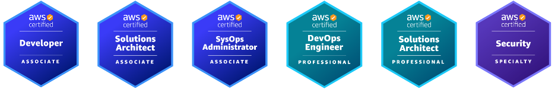
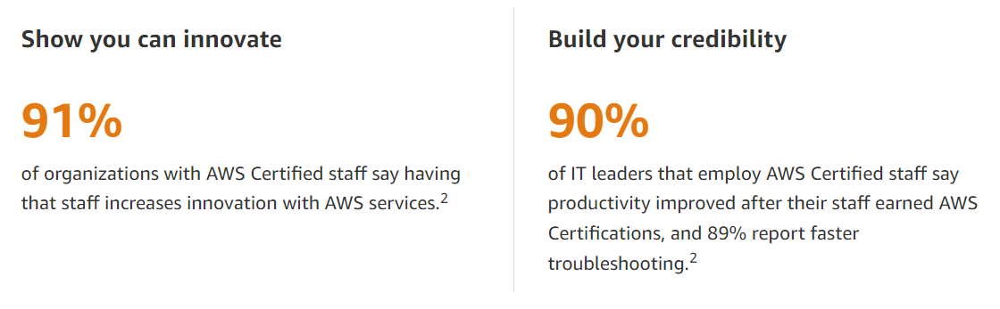

I scheduled my first AWS Exam for a Friday and had been doing the in-course questions and passing at about 80%. Then, on the Wednesday morning before the scheduled exam I took the BenchPrep official practice exam. I scored **30%**. There was an elevation of urgency.

Over the next several hours I blocked out all thinking about anything else, as much as that's possible. I was able to eleminate all social media and as much interpersonal communications as possible and isolate my brain to a dedicated task, flushing the cache on almost all other concerns and clearing my plate.

Within those two and a half days I was able to turn my 30% score on the practice exam, which is significantly easier than the full exam, into an 82% on the official exam.

Over the next few months I developed my learning process into what I call the "test->learn REPL" and passed an additional 5 AWS Certified Exams:

I learned some strong lessons about laser-focused learning, known as "deliberate practice", which I want to record for myself and which I want to share with you in this post.

NOTE: The first thing I did was to notify everyone I needed to that I would not be responding until after 6 PM Friday. You have to have your mind as clear as possible, and you can't do that if you have something hanging over it. AWS allows rescheduling.

## The Test->Learn REPL

Rapid learning is like a superpower. Learning a new technology fast means all the subsequent work you do in that technology will be much more productive.

This is why testing is closely related to the whole field of technology. Technological improvements are characterized by one significant feature: They can be tested.

Testing is the fastest way to validate your thinking.

Whenever we want to know if a person understands a topic we start asking them questions about it. Those are little tests. It doesn't prove they know the whole subject, so if we need higher levels of expertise, we continue to ask questions or we observe them working under real-world simulating test conditions.

This is the same process invlolved in learning by "experience". Experience has a very broad definition, but in the contect of learning it simply means you have been _tested_ with active business challenges.

The AWS Certified exams are an attempt to approximate a specific set of active buiness challenges in order to validate a candidate's pertainent knowlege set.

AWS Provides these stats regarding AWS Exam Certs:

In the same way that the AWS Certified exam is just an approximation of the real-world business challenges a developer may face, the Practice Exams available on Udemy, BenchPrep, and the AWS official practice questions are an approximation of the test questions on the AWS Certified Exam.

## The self-testing process

Try the free tests firsts. AWS provides practice exam questions for each offical exam along with an Exam Guide here: [Browse Exams](https://aws.amazon.com/certification/exams/?nc2=sb_ce_exm) 

There are other free exams online and very cheap ones in the Android Play Store but those are mostly a waste of time.

The best practice exams I've found are the paid exams on Udemy. They're mostly around $12, but up to $100 off-sale. Get a highly rated one and you should get a fair approximation of the offical exam content domain.

The Udemy exams allow you to take them as often as you want. That means you can you can stop if you get 2 out of the first 3 wrong.

(I am not a salesperson for Udemy. If you know of any other good practice exams please create a PR for this article.)

It also means you can start testing _before_ you start learning. I did this for a couple of exams so that I could get a baseline on the knowlege set.

* Stop taking example questions if your pass rate is less than 60%.
* Avoid "gaming" the question by thinking "AWS always favors their newest product". The've done a decent job of avoiding undue product bias in their answers.
* You'll be able to use your failed questions to narrow down the target to study your weak areas.
* Exam review has _lots_ of information about the question!

The Udemy practice exam review provides significant context for the exam question. This is the _most important part_ of the Testing->Learning REPL.

Budget a few hours after each practice exam to review, drill down in the links, and understand the context of each question you failed. For verbage-based topics you can have the browser's "Read Aloud" function read long content to you.

Udemy practice exams are typically 4 exams of 65 questions so that each exam mimics the AWS Exam. They are timed based on the AWS Exam you are practicing for.

That means you can take one exam and study the answers for a few days, and then take another practice exam with another set of questions, so you don't memorize the answer pattern. The questions are also rotated between exam attempts.

## Hazzards of Testing->Learning

You will have to monitor your thinking while you're testing to make sure you're not doing any of this:

* You are ripping yourself off every time you answer a question by pattern:
  * If you say "I remember that the question that started this way should have the answer that started that way".
  * Always only ever answer the question after you understand the full context of the question.
* _Never guess_ on the practice exams. You win _nothing_ by guessing the right answer on a practice exam. You actually rip yourself off and cause yourself to lose one valuable practice exam question every time you guess.
* If you're not sure of the answer you can flag the question. You then will have to be sure to review your flagged questions when you're doing your review process.

You can guess on the official exam and you'll lose nothing there because you can't get a list of your failed questions and review them on the official exam.

## Resources

Testing is not the source of the information you are tested on. 

The practice exams provide answers about the questions you are tested that you can view _after_ you answer the question, and those answers have content and links to other information resources.

Organized informational content can be much more effective and helpful than simply Googling each question or browsing YouTube videos.

Here are some of he resources I found most usefull and refered to most often:

### Free

* [AWS Support – Knowledge Center](https://aws.amazon.com/premiumsupport/knowledge-center/)
  * Here are some of the most frequent questions and requests that AWS receive from their customers. This is a large set of questions and answers.
* [AWS Docs](https://docs.aws.amazon.com/index.html)
* [AWS Prescriptive Guidance](https://aws.amazon.com/prescriptive-guidance/)
* [AWS Well-Architected Labs](https://www.wellarchitectedlabs.com/)

### Paid

* Udemy
  * Stephane Maarick
  * Neil
* Cantrill.io

## How to think in tests is how to think in _bets_

* Templates have checklists and checklists have checkmarks
* Rubber ducky programming is testing your exposition

## Your Note-taking System

I would advise creating a folder for all your AWS notes and using a folder-aware text editor like VS Code or Vim to become very comfortable with storing all your content.

You can create a separate folder for each AWS Exam you're pursuing and put all AWS Exam Guide and Practice Exam pdfs in that folder.

You can put a note file like `_index.md` for general notes for that folder in every folder and subfolder. That file will sort to the top.

Then you can create a git repo for that folder and push it to a host like GitHub which will render your markdown notes in a webpage, complete with image links.